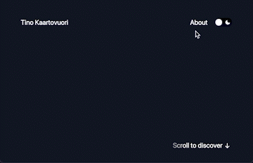

# Portfolio Web App - Tino Kaartovuori

My personal portfolio, live at [tino.kaartovuori.fi](https://tino.kaartovuori.fi).

The whole site is one idea: a Three.js scene rendered behind the page, whose meshes are pinned 1:1 to the on-screen positions of real HTML elements and advanced by one shared clock. The page scrolls natively, driven by a spring with a rubber band at the edges, and the photographs, the light fields behind the hero and the footer, the dust and the grain all follow the scroll from that one clock. [ARCHITECTURE.md](ARCHITECTURE.md) describes how it fits together; [content/README.md](content/README.md) is for changing the text and the images without touching the code.

Built with:

- Nuxt 4 (Vue 3, TypeScript) with Nuxt Content for the copy and the projects
- Three.js for the scene, with a small post-processing chain of its own
- Tailwind CSS 4 with a two-colour palette and one accent
- Lenis for the scroll gesture stream; the integrator itself is in-house
- A Nitro server with a SQLite file for the like counter and the visit log

## Commands

Node 22.13 or newer is required (`node:sqlite` is built in from there).

- `npm run dev`: development server on `:3000` with hot reloading
- `npm run build`: production build (prerendered pages plus the server that runs the like counter and the visit log)
- `npm run generate`: static version of the site (pages only; the likes and the visit log need the server)
- `npm run preview`: serves a build locally
- `npm run typecheck`: `vue-tsc` in strict mode; kept clean
- `npm run format`: Prettier over the tree, the only style gate
- `npm run deploy`: builds here and ships the result to the server (see below)

Images are generated, not committed: every original in `public/images/*.jpg` is turned into AVIF/WebP/JPEG at several widths, an Open Graph crop and the favicon set on each dev start and build.

## Usage

Clone the repository, install the dependencies and start the development server:

```bash
npm install
npm run dev
```

## Deployment

The site runs as one Node process on a DigitalOcean Droplet it shares with another app, whose Caddy owns ports 80 and 443 and routes `tino.kaartovuori.fi` to this container (the hostnames and the certificate are configured there, not here). The Droplet has 1 GB of memory, which is not enough for a Nuxt build, so the build is done on the deploying machine:

1. Once, on the Droplet: `/opt/Portfolio-Web-App/.env` from `.env.example` (`NUXT_STATS_KEY` is a long random string).
2. `npm run deploy` — builds here, ships `.output` over SSH, wraps it in its image there and starts it. `DEPLOY_HOST` overrides the target.

The like count and the visit log are one SQLite file in the `data` volume, which survives releases. The numbers are at `https://tino.kaartovuori.fi/api/stats?key=<NUXT_STATS_KEY>` (add `&days=90` for a longer window); the dashboard is GoatCounter at `https://stats.kaartovuori.fi`, which runs beside the site (`docker/goatcounter`).

## Progress so far

<details>
  <summary>September 2026</summary>
  </br>

The project was paused in May 2023 and picked up again in September 2026 for a modernization pass, and went live on 6 September 2026.

- [x] Nuxt 3.5 → 4, three.js 0.149 → 0.185, Tailwind 3 → 4, fonts self-hosted at build time
- [x] Scrolling rebuilt on native scroll: a spring integrator over Lenis' gesture stream, a rubber band at the edges, one frame loop for scroll, transform and render
- [x] Image physics rebuilt around springs: trail, bend, depth, lean, a cursor lens, film grain, a rim, halation over the whole canvas
- [x] Light fields behind the hero and the footer, wire shapes in the index rows, dust behind the page, one grain behind and over it
- [x] Copy and images moved into a content layer (`content/`), with the real projects, the about section and the footer
- [x] No preloader: the page paints as a plain document and the scene takes over from it on one reveal envelope
- [x] Likes and a visit log on a small Nitro server, GoatCounter beside it
- [x] SEO and AI-search: Open Graph, JSON-LD, sitemap, `llms.txt`
- [x] Made to work on phones: the scene scrolls with the document, passive touch, nothing widens the page
- [x] Deployed to the shared Droplet

</details>

<details>
  <summary>28.5.2023</summary>
  </br>

- [x] Dockerization of the application

</details>

<details>
  <summary>7.2.2023</summary>
  </br>


- [x] Replaced orthographic camera with a perspective one
- [x] Refactored Three.js scene, camera and renderer to one scenario object
- [x] Made prototype components that enable mapping Three.js object positions to the HTML element positions
- [x] ^ Mapped some test images and objects to HTML elements
- [x] Tested some shaders to make images react to scrolling
- [x] Added some a few new colors

</details>

<details>
  <summary>4.2.2023</summary>
  </br>


- [x] Replaced the previous canvas with Three.js version and made a prototype rounded rectangle in the scene that moves with the scroll
- [x] Made a fun custom scrollbar track
- [x] More responsive design
- [x] fix: Reimplemented toggle switch with gsap

</details>

<details>
  <summary>1.2.2023</summary>
  </br>


- [x] Implemented dark and light mode (`TailwindCSS` and `@nuxtjs/color-mode`)
- [x] Added test canvas
- [x] Used `smooth-scrollbar` and `gsap ticker` to make custom scrolling behaviour
- [x] fix: Reimplemented animated texts with gsap

</details>

<details>
  <summary>26.1.2023</summary>
  </br>



Added some nice sticky UI elements. Three.js scene will be added as background later and on top of that there will be scrollable HTML content. The scroll will be synced between the Three.js scene and HTML content and it will make a very cool effect.

Z-layer: `Sticky UI Elements` <- ( `HTML Content` <- `Three.js Scene` ) < These will have synced scroll behaivour

</details>

## Other

### License

This project is licensed under the MIT license. Please see the LICENSE file for more information.

### Author

This project was created by Tino Kaartovuori

Enjoy!
